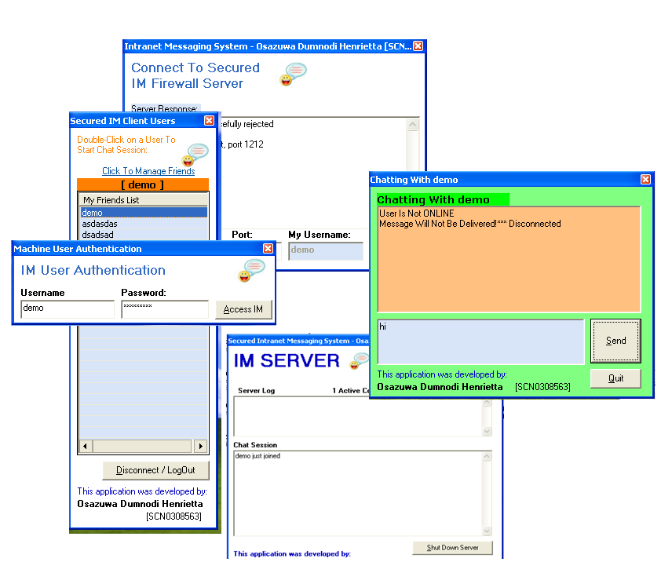



## Intranet Messaging System \(Full\-Fledged Multi\-User / FriendsList\) System \+ Firewall Server

### Description

to solve the challenge of an organisation or business that wants to its staff(connected in the LAN) to be able to communicate securely using no internet resource.
 
### More Info
 
inputs includes, logins details

             |
---                |---
**Submitted On**   |2007-11-20 21:23:02
**By**             |[Kelvins Eghosa Aghayedo](https://github.com/Planet-Source-Code/PSCIndex/blob/master/ByAuthor/kelvins-eghosa-aghayedo.md)
**Level**          |Intermediate
**User Rating**    |5.0 (10 globes from 2 users)
**Compatibility**  |VB 6\.0
**Category**       |[Complete Applications](https://github.com/Planet-Source-Code/PSCIndex/blob/master/ByCategory/complete-applications__1-27.md)
**World**          |[Visual Basic](https://github.com/Planet-Source-Code/PSCIndex/blob/master/ByWorld/visual-basic.md)
**Archive File**   |[Intranet\_M20914311212007\.zip](https://github.com/Planet-Source-Code/kelvins-eghosa-aghayedo-intranet-messaging-system-full-fledged-multi-user-friendslist-syst__1-69655/archive/master.zip)

